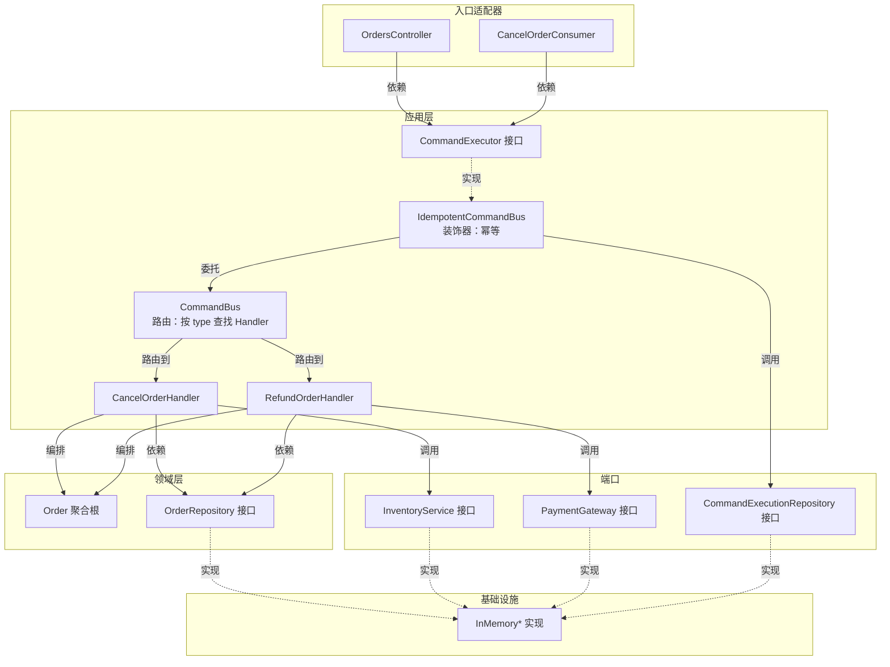

## 命令模式（Command Pattern）代码阅读指南

这个代码库实现了一套**生产级的命令模式**，不是教科书式的简单 `ICommand` + `ICommandHandler`，而是融合了**幂等、端口-适配器、装饰器模式、领域驱动设计（DDD）**等实战理念。按以下顺序阅读会更顺畅：

---

### 📖 第一层：理解"命令"是什么

| 阅读顺序 | 文件 | 核心要点 |
|:--:|------|------|
| 1 | `application/command.ts` | 所有命令的**最小契约**：`type`（稳定的运行时路由 Token）、`commandId`（幂等键）、`operatorId`（审计）。注意注释强调 `type` 是**字符串常量**（如 `'order.cancel.v1'`），不依赖 TypeScript 接口名 |
| 2 | `application/commands/cancel-order.command.ts` | 具体命令示例。`CancelOrderCommand` 是一个**不可变对象**（所有字段 `readonly`），`type = 'order.cancel.v1' as const` 保证运行时和编译期一致 |
| 3 | `application/commands/refund-order.command.ts` | 另一个命令，多了一个 `amountInCents` 字段。注意注释："金额单位为分"——这是 DDD 中避免浮点数精度问题的常见做法 |

> **关键洞察**：命令 = 不可变的"意图描述"，不包含任何业务逻辑。它像一封信，告诉系统"谁想做什么"。

---

### 📖 第二层：理解"谁来处理命令"

| 阅读顺序 | 文件 | 核心要点 |
|:--:|------|------|
| 4 | `application/command-handler.ts` | Handler 接口：`commandType` 与命令的 `type` 字符串一致；`execute(command) => TResult` 执行完整业务动作 |
| 5 | `application/commands/cancel-order.handler.ts` | **重点阅读！** 这是最核心的业务编排代码。Handler 做了什么：① 加载订单聚合 → ② 调用领域方法 `order.cancel()` → ③ 调用库存服务释放库存 → ④ 保存订单。**编排逻辑全部在 Handler 里，不在 Controller** |
| 6 | `application/commands/refund-order.handler.ts` | 退款 Handler，展示了**先校验、再调用外部支付网关、最后保存**的编排顺序。注释提到真实项目需要 Outbox/Saga 处理分布式一致性问题 |

> **关键洞察**：Handler = 业务编排器。它不包含领域规则（委托给领域对象），不包含基础设施细节（通过端口接口调用），只负责"先做什么、再做什么"。

---

### 📖 第三层：理解"命令如何路由到正确的 Handler"

| 阅读顺序 | 文件 | 核心要点 |
|:--:|------|------|
| 7 | `application/command-executor.ts` | **关键接口！** `CommandExecutor` 是 Controller 和 MQ Consumer 唯一依赖的执行边界。只有一个方法 `execute<TResult>(command) => Promise<TResult>` |
| 8 | `application/command-bus.ts` | 核心实现：用 `Map<string, Handler>` 按 `commandType` 字符串路由。`register()` 注册 Handler，`execute()` 查找并调用。注意重复注册会立即抛错（Fail-fast） |

> **关键洞察**：`CommandBus` 就像一个"命令路由器"，根据字符串 Token 找到对应的 Handler。这和 NestJS 的 `@nestjs/cqrs` 的 `CommandBus` 是同一个理念，但这里是自己实现的轻量版。

---

### 📖 第四层：理解"幂等"——重复请求不会执行两次

| 阅读顺序 | 文件 | 核心要点 |
|:--:|------|------|
| 9 | `application/command-execution.repository.ts` | 幂等记录的持久化端口。`tryStart()` 的四种结果：`STARTED`（首次）、`SUCCEEDED`（缓存结果直接返回）、`PROCESSING`（进行中拒绝）、`CONFLICT`（同 ID 不同内容——安全风险） |
| 10 | `application/idempotent-command-bus.ts` | **装饰器模式的核心！** 包装任意 `CommandExecutor`，在执行前后插入幂等逻辑：① 尝试 `tryStart` → ② 如果是 `SUCCEEDED` 直接返回缓存 → ③ 否则真正执行 → ④ 成功后标记 `SUCCEEDED` → ⑤ 失败后标记 `FAILED` |
| 11 | `application/command-fingerprint.ts` | 请求指纹：对命令内容做 SHA256 哈希。如果 `commandId` 相同但内容不同，说明有人在**复用幂等键**——可能是 Bug 或攻击 |
| 12 | `infrastructure/in-memory-command-execution.repository.ts` | 内存版幂等存储实现。注意注释：单进程内同步操作是原子的，但**多实例必须用数据库唯一索引** |
| 13 | `application/idempotent-command-bus.spec.ts` | **强烈建议阅读！** 测试展示了幂等的核心行为：重复调用同一命令，Handler 只执行一次，第二次直接返回缓存结果 |

> **关键洞察**：`IdempotentCommandBus` 是**装饰器模式**的经典应用。它不修改 `CommandBus` 的代码，只是在外层包裹了一层幂等逻辑。这就是开闭原则（OCP）——对扩展开放、对修改关闭。

---

### 📖 第五层：理解"领域模型"——业务规则的家

| 阅读顺序 | 文件 | 核心要点 |
|:--:|------|------|
| 14 | `domain/order.ts` | **聚合根**。`cancel()` 和 `refund()` 方法包含状态机校验（如"已取消的订单不能再次取消"），通过 `getStatus()` 只读暴露状态，通过 `toSnapshot()` / `fromSnapshot()` 做持久化映射 |
| 15 | `domain/domain-rule-violation.error.ts` | 领域规则违例错误。Controller 不直接处理它，由 `BusinessExceptionFilter` 统一映射为 422 |
| 16 | `domain/order.repository.ts` | 仓储接口（端口）。Handler 依赖它而不是具体数据库 |

> **关键洞察**：领域模型是"纯逻辑"，不依赖任何框架、数据库、HTTP。你可以在单元测试中直接 `new Order()` 并测试状态转换，不需要启动 NestJS。

---

### 📖 第六层：理解"如何组装起来"

| 阅读顺序 | 文件 | 核心要点 |
|:--:|------|------|
| 17 | `application/tokens.ts` | NestJS 的 Symbol Token。因为 TypeScript 接口在运行时被擦除，NestJS 无法直接用接口做依赖注入，所以用 Symbol 做桥梁 |
| 18 | app.module.ts | **组装核心！** 这里展示了三层依赖链：① `CommandBus` 注册 Handler → ② `IdempotentCommandBus` 包装 `CommandBus` → ③ Controller 依赖 `IdempotentCommandBus`（通过 `COMMAND_EXECUTOR` token） |
| 19 | app.setup.ts | 全局配置：ValidationPipe（输入校验）+ BusinessExceptionFilter（错误映射） |
| 20 | main.ts | 启动入口 |

> **关键洞察**：app.module.ts 的依赖链是理解整个架构的关键：
> ```
> Controller → COMMAND_EXECUTOR (IdempotentCommandBus) → CommandBus → Handler → Domain
> ```

---

### 📖 第七层：理解"入口适配器"

| 阅读顺序 | 文件 | 核心要点 |
|:--:|------|------|
| 21 | `orders/orders.controller.ts` | HTTP 入口。Controller 只做三件事：① 从请求头提取元数据（`@CommandMetadata`）→ ② 构造 Command 对象 → ③ 调用 `commandExecutor.execute()` |
| 22 | `interfaces/command-metadata.decorator.ts` | 自定义参数装饰器，从 `x-command-id` 和 `x-operator-id` 请求头提取命令元数据 |
| 23 | `messaging/cancel-order.consumer.ts` | MQ 入口示例。和 Controller 一模一样的模式：构造 Command → 调用 `commandExecutor.execute()` |
| 24 | `interfaces/business-exception.filter.ts` | 将领域/应用异常映射为 HTTP 状态码（如 `OrderNotFoundError` → 404, `DomainRuleViolationError` → 422） |
| 25 | `orders/order-query.service.ts` | 查询服务——**刻意不经过 CommandBus**。注释强调：命令模式用于业务动作，查询不需要包装成命令 |

---

### 🧠 整体架构图



---

### 💡 用一句话总结每个设计决策

| 设计决策 | 一句话解释 |
|------|------|
| `type: string` 而非 class name | 类名在编译/压缩后会变，字符串常量不会 |
| Command 全部 `readonly` | 不可变对象可以安全地在多个地方传递，不会有意外的副作用 |
| Handler 只依赖接口（端口） | 方便替换基础设施（内存 → 数据库），也方便单元测试 Mock |
| `IdempotentCommandBus` 装饰 `CommandBus` | 横切关注点（幂等）与业务逻辑（Handler）分离 |
| `commandId` 由调用方生成 | 客户端生成 UUID 作为幂等键，服务端不需要猜测"这个请求是不是重复的" |
| 查询不走 CommandBus | 命令 = 有副作用的业务动作；查询 = 无副作用，直接调用 Repository |
| Controller 只做协议转换 | 业务逻辑集中在 Handler，Controller 换协议（HTTP → gRPC → MQ）不影响业务 |

---

建议你现在按这个顺序**逐个文件阅读注释**（这个项目的注释写得非常详细），每读完一个文件就问自己："这个类的**唯一职责**是什么？它依赖谁？谁依赖它？"---

### 💡 用一句话总结每个设计决策

| 设计决策 | 一句话解释 |
|------|------|
| `type: string` 而非 class name | 类名在编译/压缩后会变，字符串常量不会 |
| Command 全部 `readonly` | 不可变对象可以安全地在多个地方传递，不会有意外的副作用 |
| Handler 只依赖接口（端口） | 方便替换基础设施（内存 → 数据库），也方便单元测试 Mock |
| `IdempotentCommandBus` 装饰 `CommandBus` | 横切关注点（幂等）与业务逻辑（Handler）分离 |
| `commandId` 由调用方生成 | 客户端生成 UUID 作为幂等键，服务端不需要猜测"这个请求是不是重复的" |
| 查询不走 CommandBus | 命令 = 有副作用的业务动作；查询 = 无副作用，直接调用 Repository |
| Controller 只做协议转换 | 业务逻辑集中在 Handler，Controller 换协议（HTTP → gRPC → MQ）不影响业务 |

---

建议你现在按这个顺序**逐个文件阅读注释**（这个项目的注释写得非常详细），每读完一个文件就问自己："这个类的**唯一职责**是什么？它依赖谁？谁依赖它？"